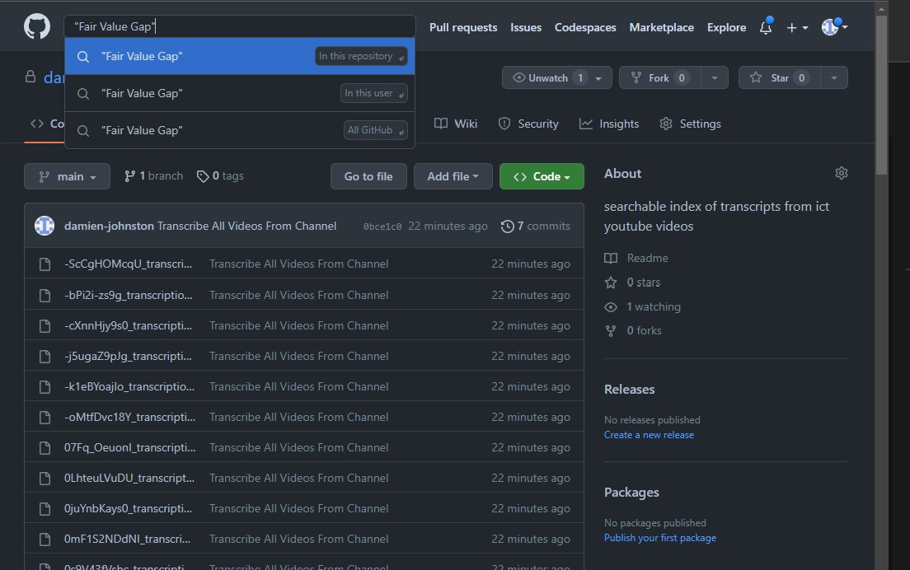
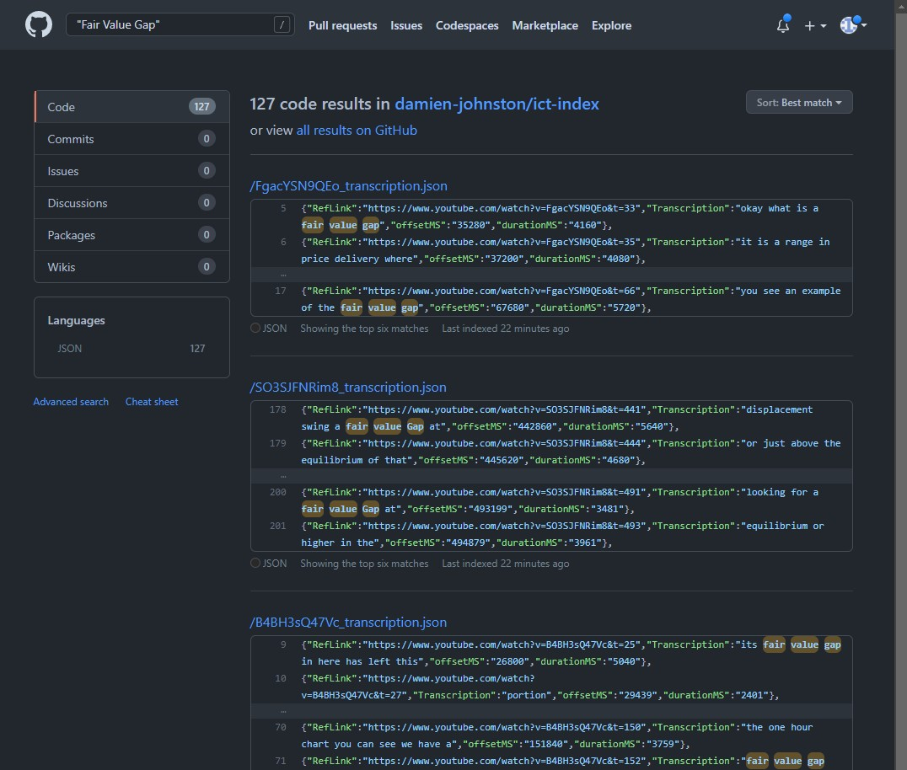
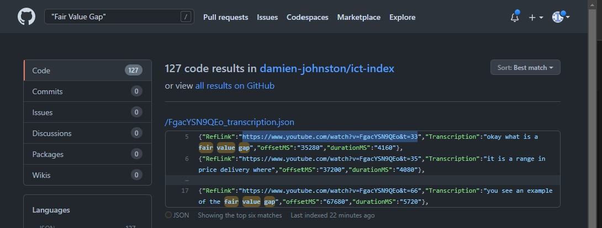
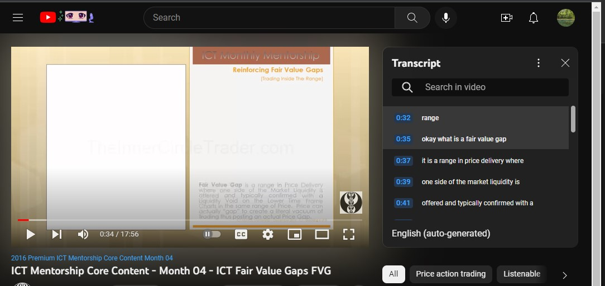

# ICT-Index
## Keyword Search for Transcribed ICT Video Content

- The content of this repo and wiki is not and should not be considered financial advice. 

### Github Search Syntax Reference
- Beta Search Syntax
  - https://cs.github.com/about/syntax

- The ict-index repo has been enrolled into the new search beta. Github added a few features to search in this pre-release.
Boolean Operators are probably the most relevant to key word and term search. We can now use AND, OR, NOT and parentheses to build better search queries.

- Examples:

- Complete search term, will return results with the entire search term only.
  - `repo:damien-johnston/ict-index "smt divergence"`

- AND operator, will return results with "smt" and "divergence" key words.
  - `repo:damien-johnston/ict-index  smt AND divergence`

- OR operator, will return results with "smt" or "divergence". 
  - Warning use parentheses to ensure the search results are what is expected.
  - `repo:damien-johnston/ict-index  (smt OR divergence)`

- Combined Logical Query Operators, will return results with "smt" and "correlation" or "divergence"
  - `repo:damien-johnston/ict-index  smt AND (correlation OR divergence)`

- Official Docs
    - https://docs.github.com/en/search-github/getting-started-with-searching-on-github/about-searching-on-github

- Cheat Sheet Gist
    - https://gist.github.com/bonniss/4f0de4f599708c5268134225dda003e0

### Notes
- The file naming convention is videoId_transcription.json
- The video id can be used for reference if needed.
- There is a 1:1 relationship between video and transcription file.
- File Naming Convention (yyyy-MM-dd-hhmmss-videoId-transcription.json) 
    - i.e. 2022-09-10-070004-FgacYSN9QEo-transcription.json
    - This naming convention shows the date and time of publication by ICT.
    - When searching for terms note the file name to understand when the term has been used.
 
 ### Known Issues
 - Copy and Paste into Github's Search Bar returns no results except for ReadMe file matches.
    - i.e. If a search term is copied and pasted into the search bar, the results are not valid.
    - When the same term is typed into the search bar the results are returned as expected. (No idea why this is the case)

### Use Case
- Keyword Search
- Use Github's Search and Limit Search Scope to This Repo

     

- Search for Keywords with Github's search syntax.
- "Fair Value Gap" will find the full term (Fair Value Gap)
- Fair Value Gap will find all files with Fair OR Value OR Gap

- Search results provide a generated url with a time offset, to the point when the term is used in the video.

     
    
- Select the URL of interest from the search results
    - `https://www.youtube.com/watch?v=FgacYSN9QEo&t=33`
    
    

- Review the content of interest
    
    

